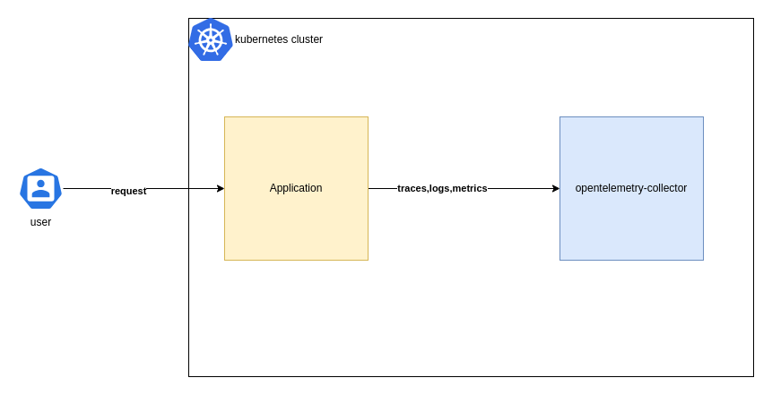

# otel-k8s-experiments

Examples for using Opentelmetry in a Kubernetes environment. 

## About
Opentelemetry[[1]](#references) and Kubernetes[[2]](#references) are two of the most popular CNCF[[3]](#references) projects[[4]](#references). 

Kubernetes is an already accepted solution for a variety of orchestration usecases, it has been tried and tested for deploying a cluster of microservices at different scales. In a distributed environment with multiple microservices, a kubernetes cluster can get quite complex as the microservices interact with each other. In such a setup, if there is no uniform layer for observability, the MTTD (Mean Time To Detect) and the MTTR (Mean Time To Resolve) can significantly go up. Having a standard observability layer would help in this situation by allowing for fetching the telemetry data (metrics, traces, logs) and displaying it in a dashboarding tool such as Grafana[[5]](#references) to trace out the flow and pinpoint the problem.

Opentelemetry is aimed at providing a standard protocol and tools for observability. It defines the opentelemetry specification[[6]](#references) for instrumenting telemetry data. The benefit of having a standard specification for telemetry data is in using the data with other tools down the line. The instrumented data can then be integrated with tools like Jaeger[[7]](#references), Zipkin[[8]](#references), Prometheus[[9]](#references), etc. or with some vendor-specific[[10]](#references) tools.

## Experiments

### 1. [Single Application Single Collector](./experiments/single-app-single-collector)

This experiment demonstrates how to set up a single application with a single opentelemetry collector. The application is a simple FastAPI application that has been auto-instrumented using the `opentelemetry-instrument` command line tool. The collector is configured to receive telemetry data from the application and log the telemetry data. 

## Applications

Following applications are used in this repository. 

### Auto Instrumented Applications

#### Python

1. [Simple FastAPI App](./common-applications/auto-instrumented/python/simple-fastapi-app) 

## References

[1] [Opentelemetry](https://opentelemetry.io) 

[2] [Kubernetes](https://kubernetes.io) 

[3] Cloud Native Computing Foundation, [CNCF](https://www.cncf.io)

[4] Chris Aniszczyk, [A look at the 2022 velocity of CNCF, Linux Foundation, and top 30 open source projects](https://www.cncf.io/blog/2023/01/11/a-look-at-the-2022-velocity-of-cncf-linux-foundation-and-top-30-open-source-projects/)

[5] [Grafana](https://grafana.com)

[6] Opentelemetry Specification, [Otel specs](https://opentelemetry.io/docs/specs/otel/)

[7] [Jaeger](https://www.jaegertracing.io)

[8] [Zipkin](https://zipkin.io)

[9] [Prometheus](https://prometheus.io)

[10] Opentelemetry Ecosystem, [Vendors](https://opentelemetry.io/ecosystem/vendors/)

