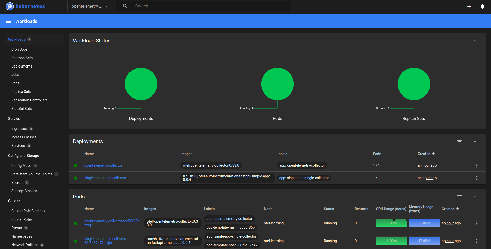
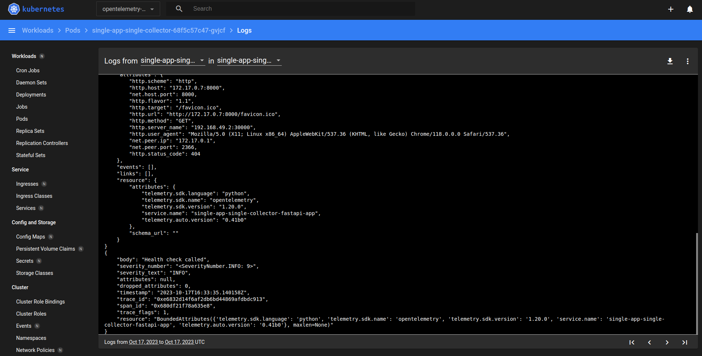
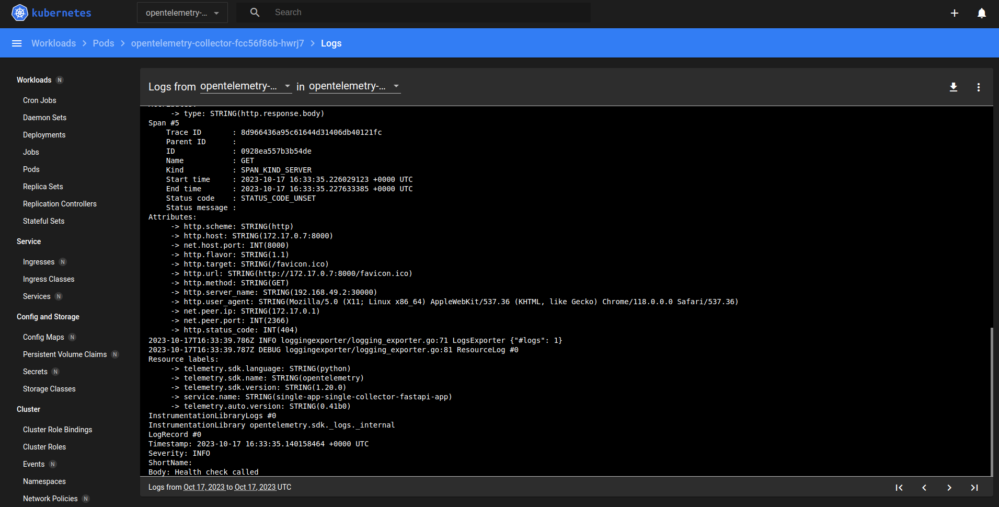
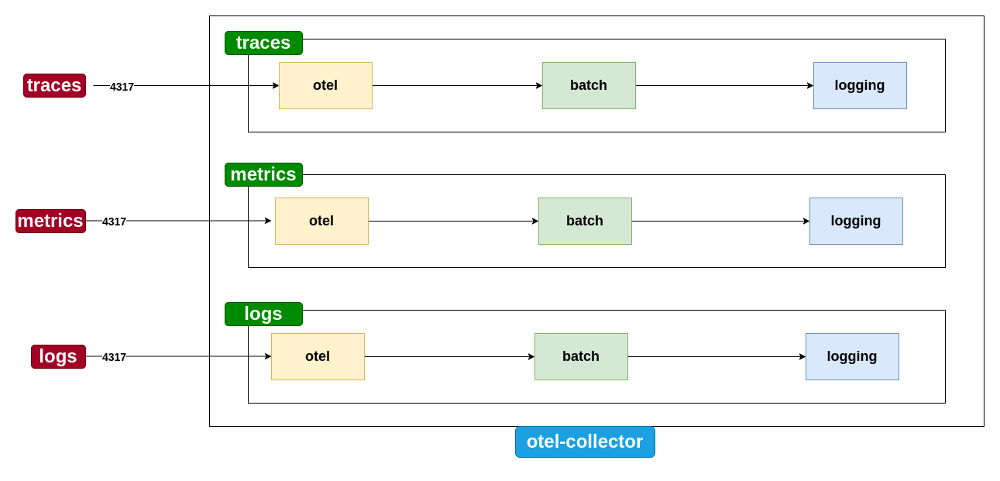

# Single App Single Collector Experiment


This experiment demonstrates a simple setup with a single application and a single collector. The application is a [simple stateful Python FastAPI application](./../../../common-applications/auto-instrumented/python/simple-fastapi-app/) which is auto-instrumented. Based on the provided configuration, the application will send telemetry data (traces, metrics, and logs) to the collector. The collector will then display the telemetry data as logs. 




***figure-1: Kubernetes Dashboard with the deployed workloads***



***figure-2: Application Telemetry***



***figure-3: Collector Telemetry***


## Architecture


### High Level Overview

On a very high level the architecture can be simplified as follows:


***figure 4: High Level Overview of the Kubernetes Cluster***

The application is a simple Python FastAPI application which is auto-instrumented. Based on the provided configuration, the application will send telemetry data (traces, metrics, and logs) to the collector. The collector will then display the telemetry data as logs.


### Detailed Architecture


***figure 5: Detailed Architecture***


The configuration consists of the following main components:

1. **Minikube Cluster**: A single node Kubernetes cluster created using Minikube.

2. **opentelemetry-demo Namespace**: A namespace created in the Minikube cluster to deploy the application and the collector.

3. **single-app-single-collector NodePort Service**: A NodePort service created in the opentelemetry-demo namespace to expose the application to the host machine.

4. **otel-collector ClusterIP Service**: A ClusterIP service created in the opentelemetry-demo namespace to expose the collector to the application.

5. **single-app-single-collector Deployment**: A deployment created in the opentelemetry-demo namespace to deploy the application.

6. **otel-collector Deployment**: A deployment created in the opentelemetry-demo namespace to deploy the opentelemetry collector.

7. **single-app-single-collector ConfigMap**: The ConfigMap containing the environment variables for the application.

8. **otel-collector ConfigMap**: The ConfigMap containing the configuration for the collector. This ConfigMap is generated using kustomize and the `otel-collector-config.yaml` file stored in the `data` folder.

### Flow

1. The user interacts with the application using the `single-app-single-collector NodePort Service` on port `30000`.

2. The service forwards the request to the application container on port `8000`.

3. The application container processes the request and generates telemetry data (traces, metrics, and logs).

4. The application container sends the telemetry data to the collector using the `otel-collector ClusterIP Service` on port `4317`.

5. The collector receives the telemetry data and displays it as logs.


## Telemetry data processing in OpenTelemetry Collector



***figure 6: OpenTelemetry Collector Pipeline***

We define a simple pipeline in the collector which receives telemetry data from the application, processes it, and displays it as logs.


## Prerequisites
In order to run this experiment, you need to have the following installed:

- [Docker](https://docs.docker.com/get-docker/)

- [MiniKube](https://minikube.sigs.k8s.io/docs)


## Setup

### Start a single node cluster using Minikube

```shell
minikube start -p otel-learning
```

### Switch to the otel-learning minikube profile

```shell
minikube profile otel-learning
```

### Deploy

To deploy, cd into the `k8s` directory and run the following command to deploy the setup.

```shell
make deploy
```

### Get the application URL

```shell
minikube service --namespace opentelemetry-demo single-app-single-collector --url
```

### Make requests

The postman collection under the [simple-fastapi-app](./../../../common-applications/auto-instrumented/python/simple-fastapi-app/docs/postman/) contains the postman collection for testing the application used in this experiment. Following the instructions in the [README](./../../../common-applications/auto-instrumented/python/simple-fastapi-app/docs/README.md#make-requests) to mock the API calls. 

Don't forget to change the `endpoint` in the postman environment to the URL obtained in the previous step (example value: `http://192.168.49.2:30000`)

### Check Collector Logs

To display the collector logs, run the following command:

```shell
kubectl logs --namespace opentelemetry-demo -l app=opentelemetry-collector --tail 100
```


### Destroy
To destroy, cd into the `k8s` directory and run the following command to destroy the setup.

```shell
make destroy
```

## View in K8s Dashboard

To view the application in the Kubernetes dashboard, run the following commands:

Switch to the otel-learning minikube profile

```shell
minikube profile otel-learning
```

Enable the dashboard and metrics server addons

```shell
minikube addons enable dashboard
```

```shell
minikube addons enable metrics-server
```

Start the dashboard

```shell
minikube dashboard
```


## Understanding the YAML configurations

### k8s/namespace.yaml

```yaml
apiVersion: v1
kind: Namespace
metadata:
  name: opentelemetry-demo
  labels:
    name: opentelemetry
```

This YAML file creates a namespace called `opentelemetry-demo` with the label `name: opentelemetry`.


### k8s/service.yaml

This yaml creates two services:

**1. single-app-single-collector NodePort Service**

This is a NodePort service which exposes the application to the host machine. This service will provide an interface to the user to interact with the application.


```yaml
spec:
  type: NodePort
  selector:
    app: single-app-single-collector
  ports:
    - protocol: TCP
      port: 8000
      targetPort: 8000
      nodePort: 30000
```

`protocol: TCP`: Specifies that the protocol used for this port is `TCP`

`port: 8000`: Specifies the port on which the service would be accessible within the cluster. Request to this port within the cluster would be forwarded to the pods that match the `selector`

`targetPort: 8000`: Specifies the port on the pods to which the traffic will be forwarded. In this case, traffic received on port 8000 will be forwarded to port 8000 on the pods matching the selector.

`nodePort: 30000`: Specifies the port on each node where the service will be accessible externally. Any traffic hitting this port on any of the cluster's nodes will be forwarded to port 8000 on the pods matching the selector.

**2. otel-collector ClusterIP Service**

This is a ClusterIP service which exposes the collector to the application. The application will send telemetry data to the collector using this service.

The service is exposed on port `4317` and the target port, which specifies the port on the pod, is `4317`.

This services uses the selector `app: opentelemetry-collector` to select the pods to expose.


```yaml
spec:
  type: ClusterIP
  selector:
    app: opentelemetry-collector
  ports:
    - name: otel-grpc
      protocol: TCP
      port: 4317
      targetPort: 4317
```

### k8s/deployment.yaml

This yaml creates two deployments:

**1. single-app-single-collector Deployment**

This is used to deploy the application. It uses the `rutush10/otel-autoinstrumentation-fastapi-simple-app` image which defines a simple FastAPI application listening on port 8000. The application is auto-instrumented using the OpenTelemetry Python SDK, and emits traces, logs, and metrics. Based on the environment variables provided, it can export telemetry data to the console or to the collector.

The deployment uses the selector `app: single-app-single-collector` to manage the replica set and pods. The replica set is configured to have only one replica of pods matching lables specified in `matchLabels`.

```yaml
  replicas: 1
  selector:
    matchLabels:
      app: single-app-single-collector
```

The pod has label `app: single-app-single-collector`, allowing it to be managed by the deployment's replica set.

```yaml
  template:
    metadata:
      labels:
        app: single-app-single-collector
```

The pod has only one container, which is the application container. The container uses the `rutush10/otel-autoinstrumentation-fastapi-simple-app` image. The container exposes port `8000` and references the `single-app-single-collector ConfigMap` for the environment variables. The resource limits are set to `1Gi` for memory and `0.5` for CPU, and the resource requests are set to `1Gi` for memory and `0.5` for CPU.


```yaml
    spec:
      containers:
      - name: single-app-single-collector
        imagePullPolicy: Always
        image: rutush10/otel-autoinstrumentation-fastapi-simple-app:0.0.4
        ports:
          - containerPort: 8000
        envFrom:
          - configMapRef:
              name: single-app-single-collector
        resources:
          limits:
            memory: "1Gi"
            cpu: "0.5"
          requests:
            memory: "1Gi"
            cpu: "0.5"
```

With this deployment definition, the application container will be exposed via the pod to the service `single-app-single-collector NodePort Service` on port `8000` (because it has the label `app: single-app-single-collector`).


**2. otel-collector Deployment**

This is used to deploy the collector. It uses the `otel/opentelemetry-collector` image which defines the OpenTelemetry Collector. The collector is configured to receive telemetry data from the application and display it as logs, the configuration is provided by mounting the `otel-collector-config.yaml` via the `otel-collector ConfigMap`.

The deployment uses the selector `app: opentelemetry-collector` to manage the replica set and pods. The replica set is configured to have only one replica.

```yaml
  replicas: 1
  selector:
    matchLabels:
      app: opentelemetry-collector
```


The pod has label `app: opentelemetry-collector`, allowing it to be managed by the deployment's replica set. This label is used by the `otel-collector ClusterIP Service` to select the pods to expose.

```yaml
  template:
    metadata:
      labels:
        app: opentelemetry-collector
```

The pod has only one container, which is the collector container. The container uses the `otel/opentelemetry-collector` image. The container exposes port `4317` and references the `otel-collector ConfigMap` for the configuration.


The resource limits are set to `1Gi` for memory and `0.5` for CPU, and the resource requests are set to `1Gi` for memory and `0.5` for CPU.

```yaml
    spec:
      containers:
      - name: opentelemetry-collector
        imagePullPolicy: Always
        image: otel/opentelemetry-collector:0.33.0
        command:
          - "/otelcol"
          - "--config=/conf/otel-collector-config.yaml"
        ports:
          - containerPort: 4317
        resources:
          limits:
            memory: "2Gi"
            cpu: "1"
          requests:
            memory: "2Gi"
            cpu: "1"
        volumeMounts:
          - name: otel-collector-config-vol
            mountPath: /conf
      volumes:
        - name: otel-collector-config-vol
          configMap:
            name: otel-collector-config
            items:
            - key: otel-collector-config.yaml
              path: otel-collector-config.yaml
```


With this deployment definition, the collector container will be exposed to the service `otel-collector ClusterIP Service` on port `4317` (because it has the label `app: opentelemetry-collector`).


### k8s/configmap.yaml

This yaml creates the `single-app-single-collector ConfigMap` which contains the environment variables for the application.

```yaml
data:
  OTEL_SERVICE_NAME: "single-app-single-collector-fastapi-app"
  OTEL_TRACES_EXPORTER: "console,otlp"
  OTEL_METRICS_EXPORTER: "console,otlp"
  OTEL_LOGS_EXPORTER: "console,otlp"
  OTEL_EXPORTER_OTLP_ENDPOINT: "http://otel-collector:4317"
  OTEL_PYTHON_LOGGING_AUTO_INSTRUMENTATION_ENABLED: "true"
```

The `OTEL_SERVICE_NAME` environment variable specifies the service name for identifying the applications telemetry data.

The `OTEL_TRACES_EXPORTER` environment variable specifies the exporters to which the application should export traces. In this case, the application will export traces to the console and to the collector. Same goes for `OTEL_METRICS_EXPORTER` and `OTEL_LOGS_EXPORTER`.

The `OTEL_EXPORTER_OTLP_ENDPOINT` environment variable specifies the endpoint to which the application should export telemetry data. In this case, the application will export telemetry data to the collector. As the collector is running within the cluster, and is exposed via the `otel-collector` ClusterIP service, the application can access the collector using the hostname `otel-collector`. Keep in mind to keep the protocol as `http` and not `https`. The collector is not configured to use TLS.


The `OTEL_PYTHON_LOGGING_AUTO_INSTRUMENTATION_ENABLED` environment variable enables auto-instrumentation for the application logs. 

This ConfigMap is referenced by the `single-app-single-collector Deployment` by using the `envFrom` field.

```yaml
        envFrom:
          - configMapRef:
              name: single-app-single-collector
```


### k8s/kustomization.yaml

This is the kustomization file which is used to generate the `otel-collector ConfigMap` using the `otel-collector-config.yaml` file stored in the `data` folder.

```yaml
generatorOptions:
      disableNameSuffixHash: true

configMapGenerator:
  - name: otel-collector-config
    namespace: opentelemetry-demo
    options:
      labels:
        app: otel-collector
    files:
      - otel-collector-config.yaml=data/otel-collector-config.yaml
```

This file also defines the yaml files for deploying the resources.

```yaml
resources:
  - namespace.yaml
  - configmap.yaml
  - service.yaml
  - deployment.yaml
```

When this file is configured in our folder, we can use the inbuilt kustomization functionality of kubectl to deploy the resources.

```shell
kubectl apply -k .
```

Similarly, we can use the inbuilt kustomization functionality of kubectl to destroy the resources.

```shell
kubectl delete -k .
```

### k8s/data/otel-collector-config.yaml

This yaml file contains the configuration for the collector. It defines the following components:

**receivers**

The receivers are the components which receive telemetry data from the application.

In this case we define an `otlp` receiver, which receives the telemetry data from the application via `grpc`. By default, a `grpc` receiver listens on port `4317`.


```yaml
receivers:
  otlp:
    protocols:
      grpc:
```

**processors**

The processors are the components which process the telemetry data received by the receivers.

In this case we define a `batch` processor, which batches the telemetry data received by the `otlp` receiver. 

```yaml
processors:
  batch:
```

**exporters**

The exporters are the components which export the telemetry data processed by the processors.

In this case we define a `logging` exporter, which displays the telemetry data as logs.

```yaml
exporters:
  logging:
    loglevel: debug
```


**service**

The service section is used to configure what components are enabled in the collector. It defines the following components:
- pipelines : defines the flow of telemetry data through receivers, processors, and exporters.
- extensions : defines the extensions used by the collector.
- telemetry : defines the telemetry components used by the collector.

In this case we define 3 pipelines:

1. **traces**: This pipeline receives traces from the `otlp` receiver, processes them using the `batch` processor, and exports them using the `logging` exporter.

```yaml
    traces:
      receivers: [otlp]
      processors: [batch]
      exporters: [logging]
```

2. **metrics**: This pipeline receives metrics from the `otlp` receiver, processes them using the `batch` processor, and exports them using the `logging` exporter.

```yaml
    metrics:
      receivers: [otlp]
      processors: [batch]
      exporters: [logging]
```

3. **logs**: This pipeline receives logs from the `otlp` receiver, processes them using the `batch` processor, and exports them using the `logging` exporter.

```yaml
    logs:
      receivers: [otlp]
      processors: [batch]
      exporters: [logging]
```

